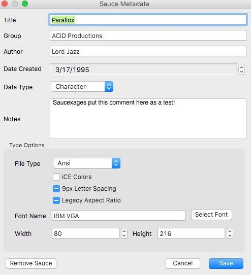

# Saucexages

```
                            ______        ______
                            \ .: /________\ :. /
                             \___    .     ___/
                               /     |      \
+--Saucexages!----------------/      :____   \----Elixir-SAUCE-Library---------+
   __________________________/_______|    \___\_____________________________
   \___     _____________   _____    |       ___________     \_  _______    \
  ___/  _____    \     _:      \_    :         \       |______/      |______/
  \________  \    \____\         \_______       \___   :      \___   :      \_
+---------\_________/---\_________/----\_________/-\___________/-\___________/-+
```

Saucexages is a library for reading, writing, analyzing, introspecting, and managing [SAUCE](http://www.acid.org/info/sauce/sauce.htm).

[SAUCE](http://www.acid.org/info/sauce/sauce.htm) is a standard used for attaching metadata to files. The SAUCE format was most commonly found in the [ANSi Art](https://en.wikipedia.org/wiki/ANSI_art) scene and generally various underground media scenes.

## Use-Cases

Common use-cases for SAUCE include:

* Adding author, group, title, and other media specific information to files
* Augmenting a file format's native metadata capabilities.
* Compatibility with SAUCE-aware software and tools such as [ANSi editors](http://picoe.ca/products/pablodraw/), [BBSs](https://en.wikipedia.org/wiki/Bulletin_board_system), [Trackers](https://en.wikipedia.org/wiki/Music_tracker), and format viewers among other possibilities.
* Finger-printing to help combat ripping, copying, and stealing of media.

## Usage

The most typical usages of Saucexages are reading, writing, removing, and checking SAUCE data.

Given an ANSI such as the following, let's have a look at the data attached:


Let's read the data stored in this ANSI:

```elixir
File.read!("assets/LD-PARA1.ANS") 
|> Saucexages.sauce()  
{:ok,
 %Saucexages.SauceBlock{
   author: "Lord Jazz",
   comments: ["Saucexages put this comment here as a test!"],
   date: ~D[1995-03-17],
   group: "ACiD Productions",
   media_info: %Saucexages.MediaInfo{
     data_type: 1,
     file_size: 52020,
     file_type: 1,
     t_flags: 0,
     t_info_1: 80, 
     t_info_2: 216,
     t_info_3: 16,
     t_info_4: 0,
     t_info_s: "IBM VGA"
   },
   title: "Parallox",
   version: "00"
 }}

```

Let's get some further detail that might be relevant to a viewer, search engine, etc:

```elixir
File.read!("assets/LD-PARA1.ANS") 
|> Saucexages.details()
{:ok,
 %{
   ansi_flags: %Saucexages.AnsiFlags{
     aspect_ratio: :none,
     letter_spacing: :none,
     non_blink_mode?: false
   },
   author: "Lord Jazz",
   character_width: 80,
   comments: ["Saucexages put this comment here as a test!"],
   data_type: 1,
   data_type_id: :character,
   date: ~D[1995-03-17],
   file_size: 52020,
   file_type: 1,
   font_id: :ibm_vga,
   group: "ACiD Productions",
   media_type_id: :ansi,
   name: "ANSi",
   number_of_lines: 216,
   t_info_3: 16,
   t_info_4: 0,
   title: "Parallox",
   version: "00"
 }}
 
```

The same data, but viewed in an ANSI drawing app, [Pablo Draw](http://picoe.ca/products/pablodraw/):



Note that much of the above data is dependent on the `file_type` and `data_type` field. For instance, note the `iCE Colors` and `Legacy Aspect Ratio` fields. These fields are specific to some media types and must be interpreted from the base `t_XXX` fields. If we were working with an audio file instead, other fields such as `sample_rate` would need to be interpreted and displayed instead.

In other words, the UI would need to change depending on the meaning of these fields which can vary. Calling `Saucexages.details/1` is one of many ways to extract such data. See `Saucexages.MediaInfo` for further functionality. 


Writing a SAUCE block:

```elixir
sauce_block =  %Saucexages.SauceBlock
{
 author: "Hamburgler",
 comments: ["I take credit for this ANSI as my own!"],
 date: ~D[2018-06-01],
 group: "Shady Activities",
 media_info: %Saucexages.MediaInfo{
   data_type: 1,
   file_size: 52020,
   file_type: 1,
   t_flags: 0,
   t_info_1: 80, 
   t_info_2: 500,
   t_info_3: 0,
   t_info_4: 0,
   t_info_s: "Amiga Topaz 1+"
 },
 title: "Donut Entry",
 version: "00"
}

# normally you'd already have a bin in memory, here we just create a fake one for example purposes
bin = <<1, 2, 3>>
{:ok, updated_bin} = Saucexages.write(bin, sauce_block)

```

Removing a SAUCE block:

```elixir
File.read!("docs/assets/LD-PARA1.ANS")
|> Saucexages.remove_sauce()
{:ok,
 <<27, 91, 50, 53, 53, 68, 27, 91, 52, 48, 109, 13, 10, 27, 91, 48, 59, 49, 109,
   97, 27, 91, 49, 48, 67, 27, 91, 48, 109, 67, 27, 91, 57, 67, 27, 91, 49, 59,
   51, 48, 109, 105, 27, 91, 57, 67, 100, 27, ...>>}
```

Removing SAUCE comments:

```elixir
File.read!("docs/assets/LD-PARA1.ANS")
|> Saucexages.remove_comments()
{:ok,
 <<27, 91, 50, 53, 53, 68, 27, 91, 52, 48, 109, 13, 10, 27, 91, 48, 59, 49, 109,
   97, 27, 91, 49, 48, 67, 27, 91, 48, 109, 67, 27, 91, 57, 67, 27, 91, 49, 59,
   51, 48, 109, 105, 27, 91, 57, 67, 100, 27, ...>>}
   
```

Checking for a SAUCE block:

```elixir
File.read!("docs/assets/LD-PARA1.ANS")
|> Saucexages.sauce?()
true

<<1, 2, 3>> |> Saucexages.sauce?()
false
```

Checking for a COMMENT block:

```elixir
File.read!("docs/assets/LD-PARA1.ANS")
|> Saucexages.comments?()
true

```

We can even separate the contents from the SAUCE
```elixir
File.read!("docs/assets/LD-PARA1.ANS")
|> Saucexages.contents()

{:ok,
 <<27, 91, 50, 53, 53, 68, 27, 91, 52, 48, 109, 13, 10, 27, 91, 48, 59, 49, 109,
   97, 27, 91, 49, 48, 67, 27, 91, 48, 109, 67, 27, 91, 57, 67, 27, 91, 49, 59,
   51, 48, 109, 105, 27, 91, 57, 67, 100, 27, ...>>}
```

Sometimes we might be working with larger files. We could do some of the work ourselves using the Elixir and Erlang `IO`and `file`
APIs, or we could be lazy and let Saucexages have a try:

```elixir
Saucexages.IO.FileReader.sauce("docs/assets/LD-PARA1.ANS")
{:ok,
 %Saucexages.SauceBlock{
   author: "Lord Jazz",
   comments: ["Saucexages put this comment here as a test!"],
   date: ~D[1995-03-17],
   group: "ACiD Productions",
   media_info: %Saucexages.MediaInfo{
     data_type: 1,
     file_size: 52020,
     file_type: 1,
     t_flags: 0,
     t_info_1: 80, 
     t_info_2: 216,
     t_info_3: 16,
     t_info_4: 0,
     t_info_s: "IBM VGA"
   },
   title: "Parallox",
   version: "00"
 }}

# We can do everything we can do when working with binary as well, such as check for a SAUCE
# This reads backwards by seeking to the end of the file and only loading in the necessary chunks, rather than a whole binary
Saucexages.IO.FileReader.sauce?("docs/assets/LD-PARA1.ANS")
true

# And for comments
Saucexages.IO.FileReader.comments?("docs/assets/LD-PARA1.ANS")
true

```

What happens when we want to handle files that don't have a SAUCE?

```elixir
# no problem here, and we get a value we can pattern match against
Saucexages.sauce(<<1, 2, 3>>)       
{:error, :no_sauce}


Saucexages.comments(<<1, 2, 3>>)       
{:error, :no_sauce}

Saucexages.details(<<1, 2, 3>>) 
{:error, :no_sauce}

# we can safely remove things without worry
Saucexages.remove_sauce(<<1, 2, 3>>)
{:ok, <<1, 2, 3>>}
  
# and of course we can attach a SAUCE block where there was none
sauce_block = %Saucexages.SauceBlock{
                author: "Lord Jazz",
                comments: ["Saucexages put this comment here as a test!"],
                date: ~D[1995-03-17],
                group: "ACiD Productions",
                media_info: %Saucexages.MediaInfo{
                  data_type: 1,
                  file_size: 52020,
                  file_type: 1,
                  t_flags: 0,
                  t_info_1: 80,
                  t_info_2: 216,
                  t_info_3: 16,
                  t_info_4: 0,
                  t_info_s: "IBM VGA"
                },
                title: "Parallox",
                version: "00"
              }

Saucexages.write(<<1, 2, 3>>, sauce_block)

{:ok,                                                                              
 <<1, 2, 3, 26, 67, 79, 77, 78, 84, 83, 97, 117, 99, 101, 120, 97, 103, 101,
   115, 32, 112, 117, 116, 32, 116, 104, 105, 115, 32, 99, 111, 109, 109, 101,
   110, 116, 32, 104, 101, 114, 101, 32, 97, 115, 32, 97, 32, 116, ...>>}
   
# notice in the return that we see <<26, 67, 79, 77, 78, 79>> as a sequence before other data
# This is our comments block, with an EOF character in front of it
<<67, 79, 77, 78, 84>>
"COMNT"
   
```

Lets learn a bit about SAUCE by via a small preview of working with some meta information about SAUCE:

```elixir
require Saucexages.Sauce

# What is the SAUCE record ID field in a binary?
Saucexages.Sauce.sauce_id()
"SAUCE"

# What is the comments block ID field in a binary?
Saucexages.Sauce.comment_id()
"COMNT"

# What is the default value for the SAUCE version?
Saucexages.Sauce.sauce_version()
"00"

# How big is a SAUCE record in bytes?
Saucexages.Sauce.sauce_record_byte_size()
128

# How many bytes of a SAUCE record is allocated to the actual data?
Saucexages.Sauce.sauce_data_byte_size
123

# How large is the smallest comments block in bytes?
Saucexages.Sauce.minimum_comment_block_byte_size()
69

# How many bytes can a single comment line fit?
Saucexages.Sauce.comment_line_byte_size()
64

# What about a comments block with 10 comments in bytes?
Saucexages.Sauce.comment_block_byte_size(10)
645

# How many bytes do we need to store a SAUCE block with 10 comments?
Saucexages.Sauce.sauce_byte_size(10)
773

# How many bytes maximum can a title hold?
Saucexages.Sauce.field_size(:title)
35

# What is the offset in a SAUCE record for the group field?
Saucexages.Sauce.field_position(:group)
62

# What is the maximum number of comment lines allowed?
Saucexages.Sauce.max_comment_lines()
255

# What are the required fields?
Saucexages.Sauce.required_field_ids()
[:sauce_id, :version, :data_type, :file_type]

# Can I use things like field size to build binaries? Yes you can.
# Let's implement the world's most naive SAUCE reader
alias Saucexages.Sauce
bin = File.read!("docs/assets/LD-PARA1.ANS")

 <<Sauce.sauce_id(),
   version::binary-size(Sauce.field_size(:version)),
   title::binary-size(Sauce.field_size(:title)),
   author::binary-size(Sauce.field_size(:author)),
   group::binary-size(Sauce.field_size(:group)),
   date::binary-size(Sauce.field_size(:date)),
   file_size::binary-size(Sauce.field_size(:file_size)),
   data_type::little-unsigned-integer-unit(8)-size(Sauce.field_size(:data_type)),
   file_type::little-unsigned-integer-unit(8)-size(Sauce.field_size(:file_type)),
   t_info_1::binary-size(Sauce.field_size(:t_info_1)),
   t_info_2::binary-size(Sauce.field_size(:t_info_2)),
   t_info_3::binary-size(Sauce.field_size(:t_info_3)),
   t_info_4::binary-size(Sauce.field_size(:t_info_4)),
   comment_lines::binary-size(Sauce.field_size(:comment_lines)),
   t_flags::binary-size(Sauce.field_size(:t_flags)),
   t_info_s::binary-size(Sauce.field_size(:t_info_s)),
 >> = :binary.part(bin, byte_size(bin), -128) 

title
"Parallox                           "
 
```

A small preview of working with Media:

```elixir
require Saucexages.MediaInfo

# Translate file type and data type to something human readable
Saucexages.MediaInfo.media_type_id(1, 1)
:ansi

# What's the file type used by SAUCE to store an s3m?
Saucexages.MediaInfo.file_type(:s3m)  
3

# What file types are valid for a character data type?
Saucexages.MediaInfo.file_types_for(:character)        
[0, 1, 2, 3, 4, 5, 6, 7, 8]

# What's the data type for a png?
Saucexages.MediaInfo.data_type(:png) 
2

# Let's work more directly with media info that we may have grabbed from a SAUCE
 media_info = %Saucexages.MediaInfo{
   data_type: 1,
   file_size: 52020,
   file_type: 1,
   t_flags: 16,
   t_info_1: 80, 
   t_info_2: 500,
   t_info_3: 0,
   t_info_4: 0,
   t_info_s: "Amiga Topaz 1+"
 }

# Let's look at some basic info about our data
Saucexages.MediaInfo.basic_info(media_info)                        
%{data_type_id: :character, media_type_id: :ansi, name: "ANSi"}

# Which fields for an ANSI are type dependent and can be translated?
Saucexages.MediaInfo.type_fields(:ansi)     
[:t_flags, :t_info_1, :t_info_2, :t_info_s]

# Let's translate only our flags
Saucexages.MediaInfo.t_flags(media_info)
{:ansi_flags,
 %Saucexages.AnsiFlags{
   aspect_ratio: :modern,
   letter_spacing: :none,
   non_blink_mode?: false
 }}

# Let's translate t_info_1 and t_info_2 in a single call
 Saucexages.MediaInfo.read_fields(media_info, [:t_info_1, :t_info_2])
%{character_width: 80, number_of_lines: 500}

# Let's just fully translate everything
 Saucexages.MediaInfo.details(media_info)
%{
  ansi_flags: %Saucexages.AnsiFlags{
    aspect_ratio: :modern,
    letter_spacing: :none,
    non_blink_mode?: false
  },
  character_width: 80,
  data_type: 1,
  data_type_id: :character,
  file_size: 52020,
  file_type: 1,
  font_id: :amiga_topaz_1_plus,
  media_type_id: :ansi,
  name: "ANSi",
  number_of_lines: 500,
  t_info_3: 0,
  t_info_4: 0
}

```

A small preview of working with Fonts:

```elixir
require Saucexages.Font

# Get the font name used in a SAUCE record
Saucexages.Font.font_name(:ibm_vga)
"IBM VGA"

# Get a known font id from its string representation
Saucexages.Font.font_id("Amiga Topaz 1+")  
:amiga_topaz_1_plus

# Get some basic info about a font to help with display
Saucexages.Font.font_info(:ibm_vga)
%Saucexages.FontInfo{
  encoding_id: :cp437,
  font_id: :ibm_vga,
  font_name: "IBM VGA"
}

# Check what fonts are available for a given font id
Saucexages.Font.font_options(:ibm_vga)   
[
  %Saucexages.FontOption{
    font_id: :ibm_vga,
    properties: %Saucexages.FontProperties{
      display: {4, 3},
      font_size: {9, 16},
      pixel_ratio: {20, 27},
      resolution: {720, 400},
      vertical_stretch: 35.0
    }
  },
  %Saucexages.FontOption{
    font_id: :ibm_vga,
    properties: %Saucexages.FontProperties{
      display: {4, 3},
      font_size: {8, 16},
      pixel_ratio: {6, 5},
      resolution: {640, 400},
      vertical_stretch: 20.0
    }
  }
]

```

For other general questions, refer to the [FAQ](FAQ.html).

## Goals

The general goals of Saucexages are:
 
 * Provide building blocks for working with the [SAUCE](http://www.acid.org/info/sauce/sauce.htm) standard.
 * Read, write, clean, and interrogate files containing SAUCE information.
 * Allow OTP behaviors to be built using Saucexages modules.
 * Avoid unnecessary processes or forced supervision trees.
 * Minimize dependencies when working with SAUCE.
 * Offer a functional, immutable interface to use with SAUCE operations. 
 * Support all types, flags, and sub-formats that may be represented by SAUCE.
 * Avoid passing too much responsibility to the clients of the library with regard to SAUCE-specific details.

## Features

Saucexages provides numerous functions and modules for working with SAUCE. Some major highlights include:

* Read and write SAUCE from both file paths and in-memory binaries
* Add/Remove SAUCE comments
* Update individual or all SAUCE fields
* Remove SAUCE records/clean files
* Fix broken SAUCE records and comments
* Support for all file type-specific fields in the SAUCE spec
* Interrogate metadata in a human-readable format
* Encode/decode specialty fields such as ANSi flags (ex: ICE Colors), fonts, pixel depth, aspect ratio, resolution, vertical stretch, letter spacing, sample rate, and more.
* Support for all media types in the SAUCE spec including bitmaps, audio files, archives, executables among others.
* Read SAUCE data in a tolerant manner that handles common mistakes found in the real-world
* Handle large files
* Offer SAUCE related constants, calculations, and more via macros and compile time features, or otherwise efficiently.
* Eliminate the need for passing around magic numbers and constants for sizes, offsets, and more when working with SAUCE.

## Should I use This?

SAUCE is generally not suitable for many formats today. If you don't know if you should being using SAUCE, you probably should not use it. The official [SAUCE](http://www.acid.org/info/sauce/sauce.htm) specification discusses this if you require further insight.

Despite the above warning, you might elect to use SAUCE if:

* You have lots of old art scene packs, music tracker files, or demo scene files that you want to categorize, search, index, etc.
* You want to write a BBS in Elixir or Erlang.
* You want to build a server that needs to process or interact with SAUCE aware content.
* You are working with a file type SAUCE supports and you want to add or change metadata. An example would be instructing a viewer how to display your ASCII or ANSi art properly.
* You are building a viewer or editor that uses one of the support file types. Particularly relevant for character graphics such as ANSi, ASCII, RIP, XBIN, BIN, etc.
* You want to do some number crunching, stats, or forensics on files that support SAUCE.
* Your data is read only until the end-of-file character, which implies you can safely use SAUCE.
* Your file type is supported by SAUCE and you perhaps want a lesser-known way of stashing some data for purposes of retrieval, augmenting the original format, or hiding some data from people who aren't aware of formats like SAUCE that work on the basis of end-of-file characters.

Some fun personal uses: 

* Scene stats such as group and artist output over time
* Analyzing the works of various artists and musicians over their "careers"
* Finding rippers and other people that stole or created suspect content
* Building a database of fully searchable art packs

You should not use SAUCE if:

* Adding data to the end of your file will cause problems.
* You can store your fields using an existing format or header directly supported by your underlying file type.
 
## Why?

Saucexages was created because I was not happy with existing libraries and to address some use-cases I had such as preservation, BBS software, and use of SAUCE on a website. Moreover, I have an overarching desire to provide libraries for formats that are lacking in various languages or require more comprehensive implementations to further my goals as related to extracting and leveraging metadata. First and foremost, however, this library is for preservation purposes and working with historic data I am interested in such as art packs.

For further discussion, see [Rationale](rationale.html).

## Limitations

SAUCE has many inherent limitations, including:

* Fields are fixed-size. Data in excess of these sizes should not be written or will be truncated.
* Comments are limited to 255 lines, 64 bytes each. If you need to add lots of text as comments in excess of these limits, SAUCE will not accommodate your use-case.
* SAUCE needs the ability to insert itself after an end-of-file character. Formats that do not respect this character may experience problems. See the file types supported by SAUCE first to determine if your file type is supported, otherwise it may experience problems if you attempt to write SAUCE data to it.
* Character fields are encoded using IBM CP437. If you need full unicode support, look elsewhere.
* Some field sizes are constrained to values that don't align 100% of the time with computing today. For instance, the file size field is constrained in size, with a policy to floor itself to zero (per the SAUCE spec) rather than wrap.
* SAUCE is not always as efficient as other metadata formats. This is because it was designed for a different era. This combined with current IO performance in the BEAM leaves it less than ideal, however given that many SAUCE'd files are very small, this is hardly an issue even at scale. Saucexages can be easily parallelized via libs such as Flow or by simply wrapping your calls in tasks or a few GenServers.